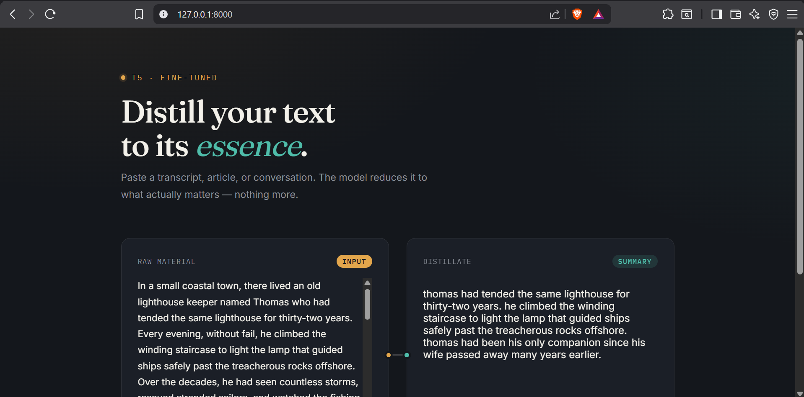
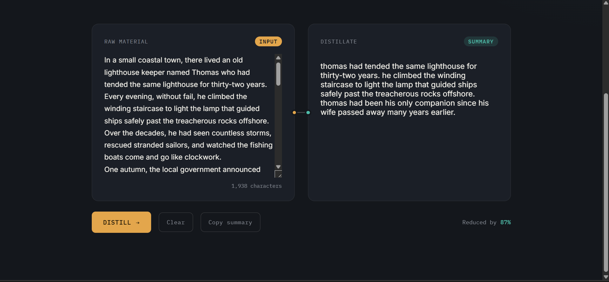

# Distill — Text Summarizer App

A web app that summarizes long text, transcripts, or conversations into their essential meaning, powered by a fine-tuned T5 model and served through a FastAPI backend.

## Demo

**Home page**



**Summary in action**



## Features

- Paste any long-form text and get a concise summary in seconds
- Clean, distraction-free interface with a live character count
- Shows how much the text was compressed (e.g. *"Reduced by 87%"*)
- One-click copy of the generated summary
- Runs locally with FastAPI + Jinja2, no external API calls needed at inference time

## Tech Stack

- **Backend:** FastAPI, Uvicorn
- **Model:** T5 (fine-tuned for summarization), Hugging Face Transformers, PyTorch
- **Frontend:** HTML, CSS, vanilla JavaScript (Jinja2 templating)
- **Model hosting:** [Hugging Face Hub](https://huggingface.co/gaur-vishesh01/text-summarizer-t5)

## Model

The model was fine-tuned on a small sample dataset (4,000 examples) in Google Colab and is hosted on the Hugging Face Hub rather than committed to this repo. `app.py` downloads it automatically at runtime:

```python
model = T5ForConditionalGeneration.from_pretrained("gaur-vishesh01/text-summarizer-t5")
tokenizer = T5Tokenizer.from_pretrained("gaur-vishesh01/text-summarizer-t5")
```

You can view the model card here: **[gaur-vishesh01/text-summarizer-t5](https://huggingface.co/gaur-vishesh01/text-summarizer-t5)**

## Getting Started

### Prerequisites

- Python 3.10+
- pip

### Installation

```bash
git clone https://github.com/GaurVishesh02/Text-Summarizer-App.git
cd Text-Summarizer-App
pip install -r requirements.txt
```

### Run the app

```bash
uvicorn app:app --reload
```

Then open your browser at:

```
http://127.0.0.1:8000
```

> Note: On first run, the model (~230 MB) will download from Hugging Face and be cached locally, so it may take a minute the first time.

## Project Structure

```
Text-Summarizer-App/
├── app.py              # FastAPI backend + model inference
├── index.html          # Frontend UI
├── requirements.txt    # Python dependencies
└── README.md
```

## How It Works

1. User pastes text into the input panel and clicks **Distill**
2. The frontend sends a POST request to `/summarize/` with the text
3. The backend cleans the text, tokenizes it, and runs it through the fine-tuned T5 model
4. The generated summary is returned as JSON and rendered in the output panel

## Limitations

- The model was fine-tuned on only **4,000 samples**, so summaries may occasionally be repetitive, overly literal, or miss nuance on longer/complex inputs
- It hasn't been evaluated on out-of-domain text (e.g. technical or legal documents) and works best on narrative or conversational text similar to its training data
- No automatic length control yet — the model decides how much to condense

## Future Improvements

- Fine-tune on a larger dataset for better generalization
- Add support for adjustable summary length
- Deploy to a live hosting platform (e.g. Render, Hugging Face Spaces)

## License

This project is open source and available under the [MIT License](LICENSE).

## Author

**Vishesh Gaur**

© 2026 Vishesh Gaur. All rights reserved.
